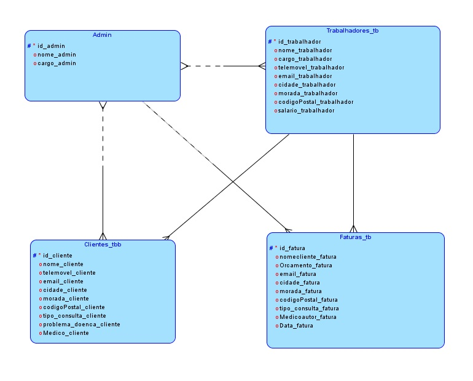

# gestclinica_Rafael1703942

O principal objetivo deste projeto será modelar uma Base de Dados Operacional que consiga realizar a gest?o de uma clínica.
Caso seja colocada em pratica irá realmente melhorar a efeciencia de uma empresa se for realmente usada em algum sistema.

Os objectivos especícos s?o: 

- Registar Clientes, Funcionários; 
- Criar uma base de dados no Oracle; 
- Criaç?o de Facturas; 
- Modelar o base de dados; 
- Definir as ferramentas que ser?o utilizadas; 
- Possibilidade de alterar qualquer tipos de dados nas tabelas;

O objectivo principal deste trabalho irá ser melhorar a organizaç?o de uma clínica para que n?o haja erros na emiss?o de dados.

- Ir?o ser armazenados todos os dados colocados no sistema na respectiva base de dados caso seja guardado de forma correta; 
- Registar todos os trabalhadores na respectiva área; 
- Pesquisa de todos os trabalhadores registados; 
- Registar todos os clientes na respectiva área; 
- Pesquisa de todos os clientes registados; 
- Registar todos os orçamentos/facturas de clientes; 
- Pesquisa de orçamentos registados no sistema; 
- Na respectiva área de orçamentos terá todo a informaç?o necessária para perceber quando foi efectuado, qual o valor do mesmo, a hora e qual o serviço efectuado no cliente.

