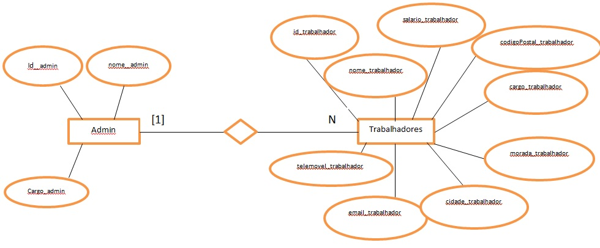
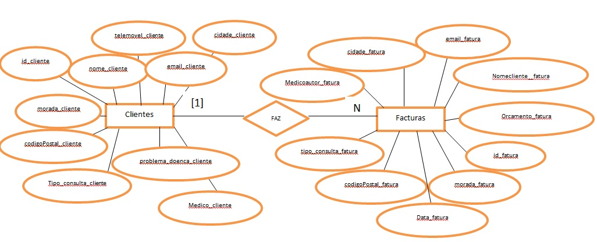
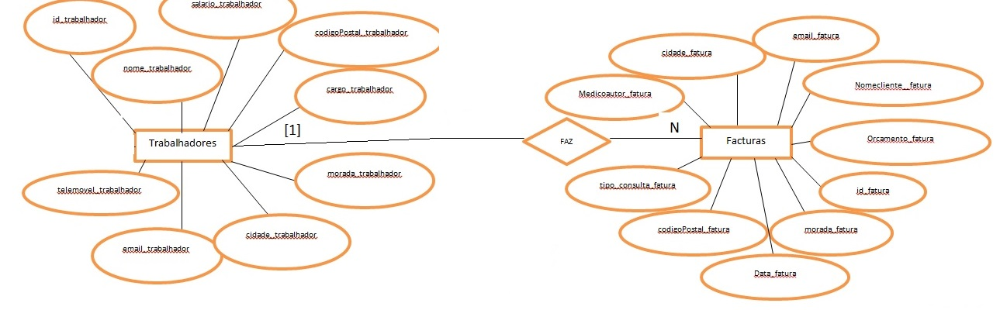
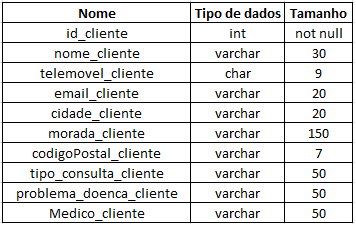
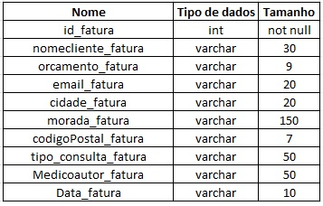
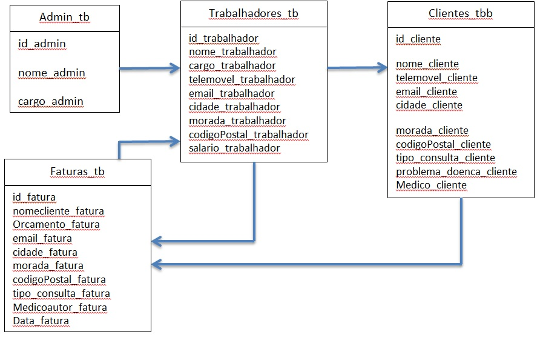
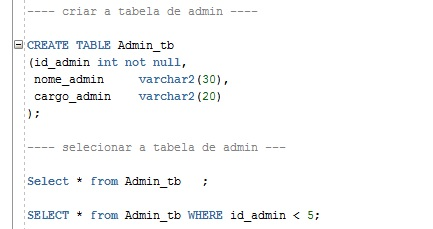
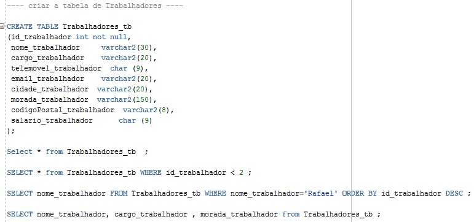
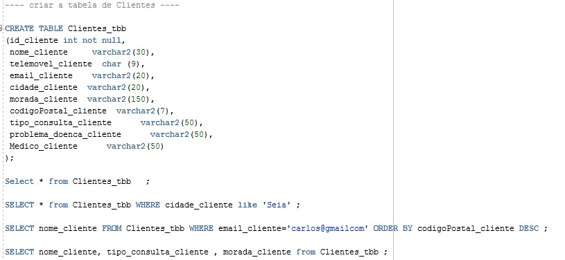
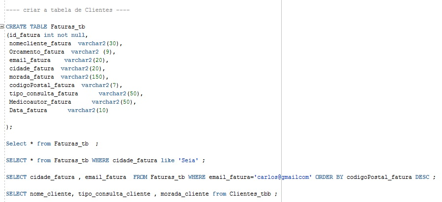

# <Rafael_Ferreira_1703942> Database - GestClinica

1- Descrição do Trabalho

O principal objetivo deste projeto será modelar uma Base de Dados Operacional que consiga realizar a gestão de uma clínica. 
Com esta base de dados conseguir fazer a gestão da area dos trabalhadores/Doutores como a do cliente e por ultimo a parte das facturas , 
onde se poderá também fazer a consulta de todos os dados das tabelas que referi.

Os objectivos especícos são:

- Registar Clientes, Funcionários;
- Criar uma base de dados no Oracle;
- Criação de Facturas;
- Modelar o base de dados;
- Definir as ferramentas que serão utilizadas;
- Possibilidade de alterar qualquer tipos de dados nas tabelas;

2- Modelo ER

A figura 2.1 ,2.2 e 2.3 apresenta o modelo entidade relacionamento do sistema de gestão de uma clinica , cada trabalhador produz a respetiva fatura do cliente e os trabalhadores registão
os clientes em sistema.

Figura 2.1: Modelo ER da base de dados operacional relacionamento do funcionamento das
tabelas onde temos as tabelas Admin e Trabalhadores.

Figura 2.2: Modelo ER da base de dados operacional relacionamento do funcionamento das
tabelas onde temos as tabelas Clientes e Faturas.

Figura 2.3: Modelo ER da base de dados operacional relacionamento do funcionamento das
tabelas onde temos as tabelas Trabalhadores e Faturas.

2.1 - Descrição da BD

O objectivo principal desta Base de dados irá ser melhorar a organização de uma clínica para que não haja erros na emissão de dados.

- Irão ser armazenados todos os dados colocados no sistema na respectiva base de dados caso seja guardado de forma correta;
- Registar todos os trabalhadores na respectiva área;
- Pesquisa de todos os trabalhadores registados;
- Registar todos os clientes na respectiva área;
- Pesquisa de todos os clientes registados;
- Registar todos os orçamentos/facturas de clientes;
- Pesquisa de orçamentos registados no sistema;
- Na respectiva área de orçamentos terá todo a informação necessária para perceber quando foi efectuado, qual o valor do mesmo, a hora e qual o serviço efectuado no cliente.

2.2- Entidades-tipo

2.3- Entidades-fracas

2.4- Atributos/Dimensões

Trabalhradores: entidade responsável por armazenar e modificar as informações dos clientes registados;
Faturas: entidade responsável para armazenar os agendamentos/orçamentos de serviços efetuados;

Figura 3.1: Tabela de Administrator.

Clientes/Faturas: entidade responsável por armazenar os clientes/faturas registados será o trabalhador o responsavel: 
1) Registar admins - id do admin /nomeadmin/cargoadmin
2) Registar Trabalhador - id trabalhador /Nome trabalhador /Cargo trabalhador/ tele movel trabalhador / email trabalhador/ cidade trabalhador/ morada trabalhador/ codigo postal do trabalhador / salario trabalhador

Figura 3.2: Tabela de Funcionários.

Figura 3.3: Tabela de Clientes.

Figura 3.4: Tabela de Faturas.

3) Registar cliente - id cliente /Nome cliente /telemovel cliente/ email cliente / morada cliente/ codigo postal cliente/ tipo de consulta cliente/ problema doença do cliente / medico do cliente
4) Faturas - id fatura /Nome cliente fatura /orçamento fatura/ email fatura / cidade fatura/ morada fatura/ codigo postal fatura/ tipo de consulta fatura / medico autor fatura / Data fatura

2.5- Relações

Nos modelos de bases de dados relacionais, a tabela é um conjunto de dados dispostos em nú mero infinito de colunas e número ilimitado de linhas. 
As colunas são tipicamente consideradas os campos da tabela, e caracterizam os tipos de dados que deverão constar na tabela.

Figura 2.4: Modelo ER da base de dados operacional relacionamento do funcionamento das
tabelas onde temos as tabelas Trabalhadores e Faturas.

2.6- Modelo Lógico

Figura 2.5: Modelo ER da base de dados operacional relacionamento do funcionamento das
tabelas onde temos as tabelas Trabalhadores e Faturas. 
Os objetivos do sistema de Gestão de uma Clinica é a automatização das etapas presentes neste tipos de trabalhos. 
Os objetivos específicos são: 

1) Registar Clientes, Funcionários; 
2) Criar uma base de dados no Oracle ; 
3) Criação de Facturas; 
4) Modelar o base de dados; 
5) Definir as ferramentas que serão utilizadas;
6) Possibilidade de alterar qualquer tipos de dados nas tabelas.

2.7- Modelo Relacional

3- Exemplos de uso da Syntax dos comandos SQL (CRUD)

Permite criar , apagar e pesquisar as tabelas de Administrador , Trabalhadores, Clientes e Faturas.

Figura 4.3: Tabela de Administradores.

Figura 4.4: Tabela de Trabalhadores.

Figura 4.5: Tabela de Clientes.

Figura 4.6: Tabela de Faturas.

3.1- Geral

Criei uma tabela de admin que será a do gestor/criador da mesma que poderá realizar
modificações , a tabela de trabalhadores para registar as informações , caso seja necessário
consultar também as informações acerca deles , e por ultimo ainda conseguir emitir facturas
consoante a informação colocada nas respectivas tabelas , foi também criada a tabela de clientes
onde posso colocar/pesquisar os dados do cliente para que seja possível fazer emissão de uma
factura pois é necessário certas informações , e por ultimo a tabela de facturas onde faço
pesquisa e a emissão das mesmas.

3.3- MySql (Create,Read,Update,Delete)

Exemplo da tabela Administrador !

-Create

CREATE TABLE Admin_tb 
(id_admin int not null,
 nome_admin     varchar2(30),
 cargo_admin    varchar2(20)
);

-Read

Select * from Admin_tb   ;
SELECT * from Admin_tb WHERE id_admin < 5;
SELECT nome_admin FROM Admin_tb WHERE nome_admin='Rafael' ORDER BY id_admin DESC ;
SELECT nome_admin, cargo_admin from Admin_tb ;

-Update

UPDATE Admin_tb
SET id_admin ='10'
WHERE nome_admin ='Joao'
AND cargo_admin ='Controlador'
;

- Delete

DELETE FROM Admin_tb WHERE cargo_admin = 'Controlador';

- Insert

begin
    insert into Admin_tb values (1, 'Rafael', 'Gestor');
    insert into Admin_tb values (2, 'Rafael', 'Designer');
    insert into Admin_tb values (3, 'Rafael', 'Chefe');
    insert into Admin_tb values (4, 'Rafael', 'Controlador');
    insert into Admin_tb values (5, 'Rafael', 'Tester');
    insert into Admin_tb values (6, 'Rafael', 'Trabalhador');
    insert into Admin_tb values (7, 'Rui', 'Tester');
    insert into Admin_tb values (8, 'Alfredo', 'Tester');
    commit;
end;

- Alter

alter table Admin_tb add constraint id_admin primary key (id_admin);

4- Conclusão

O desenvolvimento e implementação da pesquisa na base de dados criada mostrou ser um
projeto muito interessante desde o início, o que me motivou para a criação do mesmo. Consegui
com este projeto desenvolver novas técnicas nunca antes utilizadas por mim o que foi gratificante
e serviu para um grande desenvolvimento nesta linguagem. O meu projeto pode ainda não ter
nesta fase uma implementação prática, não tendo uma estrutura exequível para aplicar em
empresas. Serviu certamente para perceber a complexidade de um programa de faturação
de simples execução e perceber a quantidade de testes necessários para conseguir satisfazer
a necessidades basicas para chegar ao nivel de um base de dados para faturação. Criando
cenários ou até mesmo simulação de funções/metodos para que o mesmo chegue ao ponto
perfeito. Grande foco principal foi sempre construir uma base de dados simples de entendimento
e execução tornando-a organizada para que caso seja implementado ter rendimento e melhorar
assim a eficiencia de uma pequena empresa. Agradecer ao Professor porque sem ajuda dele não
seria possível chegar onde cheguei com este projeto.

5- Bibliografia

[1]https://www.devmedia.com.br/tutorial-sql/2973
[2]https://www.youtube.com/watch?v=0xO1rVj6oHAabchannel = B
[3]https://www.devmedia.com.br/trabalhando-com-tabelas-no-oracle-mysql-e-sql-server/31622
[4]https://www.devmedia.com.br/sql-select-guia-para-iniciantes/29530
[5]https://www.devmedia.com.br/sql-clausula-where/37645
[6]https://www.w3schools.com/sql/sql_update.asp
[7]https://www.w3schools.com/sql/sql_create_table.asp

